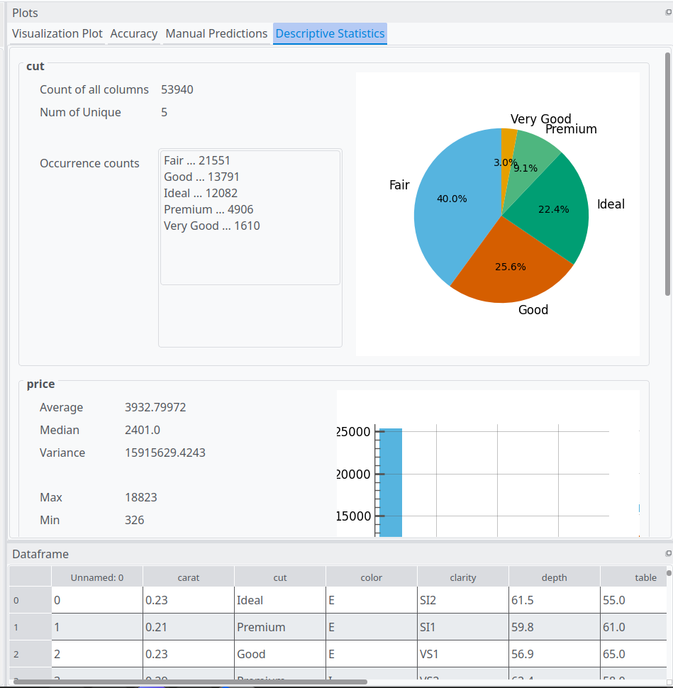

<!--
Important Notes: 
    Length : 750 words - 1,750 words

-->

# Summary

Data science is often taught at the upper undergraduate levels, with programming often cited as a prerequisite for learning data science. DataScratch is software intended to teach novices the core concepts of data science, without the prerequisite of knowing how to program. DataScratch achieves this via an intuitive drag and drop interface modeled after scratch.

# Statement of need

The current educational landscape presents a significant hurdle for novices seeking to engage with data science. While foundational mathematical concepts like algebra and basic statistics are often introduced in high school, students often do not study data science and AI until middle-late undergraduate. 

Many educators cite that programming is a barrier to entry to data science [@bart2016implementing;@thayer2020practical;@brunner2016teaching]. This is because many tools and libraries for data science are called programmatically. The cognitive load associated with learning both programming syntax and complex statistical concepts simultaneously is often deemed detrimental to meaningful learning.

This lack of accessible entry points limits the potential for widespread data science literacy. As AI increasingly permeates various aspects of modern life understanding its underlying principles becomes essential.  Data science literacy empowers individuals to critically evaluate these systems, fostering informed decision-making and promoting responsible technological development[@provost2013data;@jain2021smart]. Moreover, a basic grasp of AI models can demystify complex technologies, enabling students to navigate a world shaped by intelligent systems with greater confidence and agency.[@hsu2025effects]

Therefore, there's an urgent need for tools that prioritize accessibility and intuitive learning. A low barrier to entry is paramount; users should be able to explore core data science concepts without needing prior programming experience. This necessitates a paradigm shift away from code-centric approaches towards user-friendly interfaces that abstract the complexities of programming while preserving the fundamental principles of data analysis.

DataScratch directly addresses this need by offering a visual, drag-and-drop environment for building and experimenting with AI models. By removing the immediate requirement to write code, DataScratch provides novice users with an accessible gateway to exploring core concepts in data science and AI. 

# State of the field

There are several no-code, low code platforms available on the internet. However these are often designed with power users in mind, and are often expensive, making them frustrating to novices. Many of these softwares are geared toward commercial data science use, with a focus on integration with common business tools. 

| Name        | Description                | Target Audience | License              | Drag and drop |
|-------------|----------------------------|-----------------|----------------------|---------------|
| DataBricks  | Generative AI              | Businesses     | Paid / Commercial    | No            |
| Power BI    | Visualization Interface    | Businesses     | Paid / Commercial    | Yes           |
| Rapid Miner | Training / Visualization   | Data Scientists | Free for individuals | No            |
| JASP        | Statistics / Visualization | High Undergraduate / Graduate        | Free                 | No            |

Scratch[@resnick2009scratch], a visual programming language designed for children, offers a compelling model for accessible computational learning. Its intuitive drag-and-drop interface allows beginners to grasp fundamental programming concepts without needing to decipher complex syntax. Scratch's interface has been proven to be effective at teaching novices programming concepts, and assist learners when the transition to "real" programming[@armoni2015scratch].

# Software design

The language for this software is python, this is because python possesses several libraries, such as pandas[@reback2020pandas], matplotlib[@Hunter:2007], and scikit-learn[CITATION], which are standard tools for data science and AI modeling. Another reason would be portability. If a user desires features that are beyond the scope of DataScratch, the software is built in a way the models and utilizes underlying data science libraries, to make the transition from using DataScratch to programming in python easier.

The GUI software was originally written using a python library called PyGtk[CITATION], however after several months of development this library was dropped, due to the PyGtk library having a non-functional pip installation, and graphical issues when run on windows. Additionally, electron was considered, with the benefit being easier styling, however it did not posses seamless python support. The project later switched to PyQt, which featured cross platform support, and allowed for installation via pip by default. 

The drag and drop components are modeled closely after scratch[resnick2009scratch].  The shape of each draggable block corresponds to a shape on the pipeline to give the user visual signifiers telling them where things should go. The purpose of this change is to reduce the complexity of the interface.  

The interface also enables the user to assemble and train multiple models at once, allowing for quick model comparison. This enables common user desires within data science, where data scientists often compare and contrast models. Another purpose of this feature is to allow users to learn the differences between certain models. 

Additionally, Datascratch comes pre-loaded with several example datasets, which have been crafted to be usable to a wide range of users, allowing novices to get learning right away, without having to procure a dataset first. The image below shows the output from a descriptive statistics query.  

# Research impact statement

* Talk about the near-term significance (benchmarks, reproducible materials, community-readiness signals).
  * Enhanced Data Science Literacy
  * Democratization of AI literacy

# AI usage disclosure
The dataframe_viewer class was heavily written by AI. This is a small subclass which renders a pandas dataframe as a PyQt table. Google was used to search for API documentation. The built in AI overview on google cannot be deactivated, and thus the AI overview was unintentionally used upon each google search. Oftentimes, the AI overview provided false information, and was later ignored due to a lack of verifiability. 

Generative AI was later used during the proofreading stage of writing the paper, with it helping catch several clarity and grammatical errors. These AI suggestions were then verified with human experts. 

# References