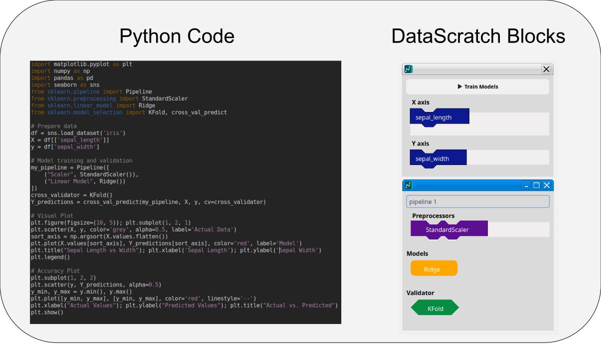

<!--
Important Notes: 
    Length : 750 words - 1,750 words

-->

# Summary
Data science is a current and evolving field. Currently, this field is historicity a extremely coding heavy field. DataScratch is a novel approach to perform data science tasks, such as model training, and validation, through drag and drop interface without requiring heavy coding knowledge.  

# Statement of need

High school and middle school educations often times cover the foundations and core requisites for data science, such as plotting and algebra. However data science is very rarely taught at this level, many educators cite that programming is a barrier to entry to data science. This is because many tools and libraries for data science are called programmaticly. 

Learning data science tangentially to learning programming is difficult, and often not recommended by educators[CITATION]. As learning to program is a substantial undertaking on it's own, and learning two difficult concepts at the same time is not recommended.

Data science literacy is useful, and can help students later in their careers to be able to understand AI models, and create and modify their own models. Learning about basic AI models could also help students better understand the AI models that influence their own lives. 

Data science should have a low floor to entry, with little to no context required, so that anyone can pick up the core concepts of data science, and go with them. 

DataScratch aims to lower this barrier, and provide novice users an entry to AI modeling, without the prerequisite of learning to code. DataScratch enables users to perform regression modeling, and classification modeling, via a drag and drop interface. 

# State of the field

There are several no-code, low code platforms available on the internet. However these are often designed with power users in mind, and are often expensive, making them frustrating to novices. 

| Name        | Description                | Target Audience | License              | Drag and drop |
|-------------|----------------------------|-----------------|----------------------|---------------|
| DataBricks  | Generative AI              | Businesses     | Paid / Commercial    | No            |
| Power BI    | Visualization Interface    | Businesses     | Paid / Commercial    | Yes           |
| Rapid Miner | Training / Visualization   | Data Scientists | Free for individuals | No            |
| JASP        | Statistics / Visualization | High Undergraduate / Graduate        | Free                 | No            |

These softwares are often times geared toward commercial use, and rarely aimed at students and novices. Often these softwares have a high learning curve, somting that makes the software harder to use.   

Scratch, a software aimed at teaching children coding concepts via drag and drop blocks, is widely known for it's easy of use. This intuitive interface allows beginners to quickly grasp fundamental programming principles like sequencing, loops, and conditional logic without getting bogged down in complex syntax. DataScratch aims to solve a very similar problem that scratch solves, allowing users to interface with AI model training via a drag and drop interface. 

# Software design
The drag and drop interface is widely modeled after the same style as scratch blocks, this is "block-like" style is intended to give the user an intuitive and tactile feel. 

The language for this software is python, this is because python possesses several libraries, such as pandas[CITATION], matplotlib[CITATION], and scikit-learn[CITATION], which are standard tools for data science and AI modeling. Another reason would be portability. If a user desires features that are beyond the scope of DataScratch, the software is built in a way the models and utilizes underlying data science libraries, to make the transition from using DataScratch to programming in python easier.

The GUI software was originally written using a python library called PyGtk[CITATION], however after several months of development this library was dropped, due to the PyGtk library having a non-functional pip installation, and graphical issues when run on windows. Additionally, electron was considered, with the benifit being easier styling, however it did not posses seamless python support. The project later switched to PyQt, which featured cross platform support, and allowed for installation via pip by default. 

The drag and drop components are modeled closely after scratch[CITATION], a library which has been shown to be very intuitive and easy to use[CITATION]. This choice was intended to make the software easier to use for people who aren't heavy coders. The shape of each draggable block corresponds to a shape on the pipeline to give the user visual signifiers telling them where things should go.  

The interface also enables the user to assemble and train multiple models at once, allowing for quick model comparison. This enables common user desires within data science, where data scientists often compare and contrast models. 

# Research impact statement

# AI usage disclosure
The dataframe_viewer class was heavily written by AI. This is a small subclass which renders a pandas dataframe as a PyQt table. Google was used to search for API documentation. The built in AI overview on google cannot be deactivated, and thus the AI overview was unintentionally used upon each google search. Oftentimes, the AI overview provided false information, and was later ignored due to a lack of verifiability. 

Generative AI was later used during the proofreading stage of writing the paper, with it helping catch several clarity and grammatical errors. These AI suggestions were then verified with human experts. 

# Citations
