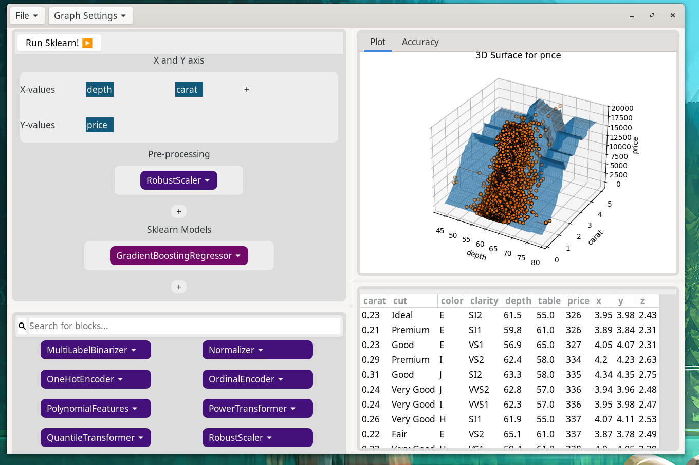

## Background & Inspiration

Invented in 2003 scratch is a programming language intended for children ages 10 - 15. The intent of this project was to model programming concepts via large colorful blocks, to teach children the basics of programming. Scratch has since been a massive success, as of 2023 scratch go 95 million monthly visits, some fo those recurring users, other programming novices. 

This language was intended to model real world programming, whilst giving children a streamlined experience, free of the frustrating nature of learning to code. 

*Side by side comparison of scratch versus python*

Upon it's initial completion scratch had three defining features.
1. **The scratch compiler ALWAYS compiles** Scratch will never throw an exception or raise a ValueError, this was to shield novices from the frustration of syntax errors.
2. **Drag and Drop Blocks** Scratch is programmed through drag and drop blocks, allowing for novices to learn in a more intuitive way. As well as preventing students from copying and pasting answers, ensuring that their exploration and interaction with the material remains exploratory. 
3. **Examples** Scratch comes preloaded with examples and tutorials, leading to a more streamlined experience.    

##  Project Goals & Summary
The goal of this project is to make a learning software for novices and high schoolers to learn core data science concepts, such as overfiting, and linear vs non-linear models. 

I plan to do so using a "Drag and Drop" system, very similar to how scratch operates.

*A draft of the current drag and drop interface versus python code.*

This would allow students and novices to learn in a similar way to scratch, dragging and dropping components, in an intuitive manner. 

### Project sub-goals:
1. **Project always compiles** DataSeedlings should never not compile, the compiler should be written in a way that the project always results in an output, even if that output is a blank graph. 
2. **Drag and drop data-science components** Drag and drop column values, as well as sklearn components to build and AI model. 
3. **Examples** This software should have example datasets, and later linked tutorials to facilitate learning. 
4. **Compatibility** This software should allow for the exporting and saving of data, so students can save their projects and share them (presumably with proud parents)

## Natrually AI Resitant
With the rise of AI, I found that many of the students that I would tutor would be simply copying and pasting code from chatGPT, without actually understanding it. This outlines on of the strengths of drag and drop blocks, which are naturally resistant to forms of copy and paste, allowing for students to have a more natural way of learning through exploration, while also subtely disallowing the use of AI. 

## Exploratory Learning
roject is supposed to encourage exploration and experimentation. The modular drag and drop system is part of this, allowing for users to swap out models on the fly, leading to them learning the differences between different models more in-depth, due to a tactile, hands on experience.

## Current works
Currently, there is still a lot to work on for this application, most of the core application features have been implemented, but there is still a lot of software development left to do. 



*Pre-UI/UX redesign Fall 2025*
## Running the current GUI
Warning; this is a work in progress, and bugs are a near guarantee. 

To run the GUI
```
source .venv/bin/activate
python3 main.py example_datasets/iris.csv
```
There are several other example csv's I have included, They are veiwable thru the "example_datasets" folder. 


